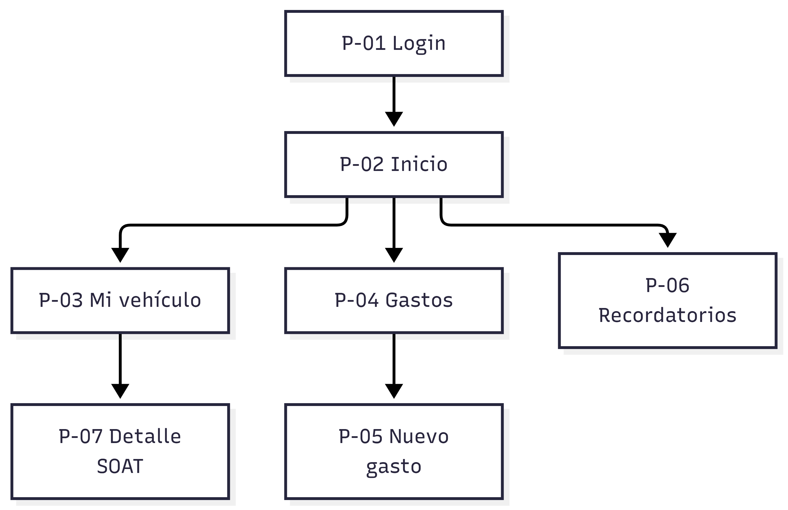

# Definición del proyecto DriveWise

## Ficha del proyecto

| Dato | Información |
|---|---|
| Proyecto | DriveWise |
| Asignatura | Programación Móvil (IF2004) |
| Grupo | 20262-IF2004-PROGRAMACIÓN MÓVIL-G602svg |
| Integrantes | Jorge Giraldo, Santiago Echeverri, Alejandra Villa |
| Versión | 1.0 |
| Fecha | 2026 |

## Tabla de contenido

1. [Descripción general](#1-descripción-general)
2. [Problema](#2-problema)
3. [Objetivos](#3-objetivos)
4. [Stakeholders, actores y roles](#4-stakeholders-actores-y-roles)
5. [Alcance](#5-alcance)
6. [Funcionalidades](#6-funcionalidades)
7. [Requerimientos funcionales](#7-requerimientos-funcionales)
8. [Requerimientos no funcionales](#8-requerimientos-no-funcionales)
9. [Reglas de negocio](#9-reglas-de-negocio)
10. [Modelo de datos](#10-modelo-de-datos)
11. [Pantallas y mapa de navegación](#11-pantallas-y-mapa-de-navegación)
12. [Mockup](#12-mockup)
13. [Historias de usuario, casos de uso, restricciones y supuestos](#13-historias-de-usuario-casos-de-uso-restricciones-y-supuestos)
14. [Arquitectura técnica y navegación implementada](#14-arquitectura-técnica-y-navegación-implementada)

## 1. Descripción general

DriveWise es una aplicación para ayudar a los usuarios a llevar un control de sus vehículos.

La aplicación permitirá registrar vehículos y guardar información importante como gastos, combustible, mantenimientos y documentos.

También tendrá recordatorios para ayudar al usuario a estar pendiente de fechas importantes como el SOAT, la revisión técnico-mecánica y otros documentos.

## 2. Problema

Muchas personas tienen dificultades para llevar un control de los gastos y documentos de sus vehículos.

La información puede estar guardada en diferentes lugares y esto hace que sea fácil olvidar fechas de vencimiento o no saber cuánto dinero se ha gastado en el vehículo.

Por esta razón se propone crear una aplicación que permita tener esta información organizada en un solo lugar.

## 3. Objetivos

### Objetivo general

Crear una aplicación que permita administrar de forma sencilla la información de uno o varios vehículos.

### Objetivos específicos

- Registrar vehículos.
- Consultar la información de cada vehículo.
- Registrar gastos y combustible.
- Registrar mantenimientos.
- Guardar información de documentos.
- Mostrar recordatorios de fechas importantes.
- Consultar el historial del vehículo.

## 4. Stakeholders, actores y roles

El principal usuario de la aplicación es el propietario del vehículo.

También se considera el equipo encargado del desarrollo de la aplicación.

| Actor | Descripción |
|---|---|
| Usuario | Persona que utiliza la aplicación para administrar sus vehículos. |
| Administrador | Persona encargada de administrar el sistema. |
| Equipo de desarrollo | Grupo encargado de crear y mantener la aplicación. |

## 5. Alcance

La aplicación permitirá registrar y consultar vehículos, gastos, combustible, mantenimientos y documentos.

También tendrá una sección de recordatorios y un historial de información del vehículo.

En esta primera etapa se desarrollará principalmente la navegación y las pantallas principales de la aplicación.

No se incluirán funciones como compras, pagos dentro de la aplicación o venta de vehículos.

## 6. Funcionalidades

Las principales funcionalidades de DriveWise son:

- Inicio de sesión.
- Registro de vehículos.
- Consulta de información del vehículo.
- Registro de gastos.
- Registro de combustible.
- Registro de mantenimientos.
- Consulta de documentos.
- Recordatorios.
- Consulta del historial.

## 7. Requerimientos funcionales

| ID | Requerimiento |
|---|---|
| RF-01 | El usuario podrá iniciar sesión. |
| RF-02 | El usuario podrá registrar un vehículo. |
| RF-03 | El usuario podrá consultar sus vehículos. |
| RF-04 | El usuario podrá registrar gastos. |
| RF-05 | El usuario podrá registrar mantenimientos. |
| RF-06 | El usuario podrá consultar documentos del vehículo. |
| RF-07 | El sistema mostrará recordatorios. |

## 8. Requerimientos no funcionales

| ID | Requerimiento |
|---|---|
| RNF-01 | La aplicación debe ser fácil de usar. |
| RNF-02 | La aplicación debe tener una navegación clara. |
| RNF-03 | La aplicación debe funcionar en dispositivos compatibles con Flutter. |
| RNF-04 | La información debe presentarse de forma organizada. |

## 9. Reglas de negocio

| ID | Regla |
|---|---|
| RN-01 | Primero se debe registrar un vehículo antes de asociarle gastos, combustible o mantenimientos. |
| RN-02 | Los gastos deben estar relacionados con un vehículo. |
| RN-03 | Los documentos pueden tener una fecha de vencimiento. |
| RN-04 | Los mantenimientos pueden programarse por fecha o kilometraje. |
| RN-05 | El kilometraje de un vehículo no debe disminuir normalmente. |
| RN-06 | Los recordatorios importantes deben mostrarse al usuario. |

## 10. Modelo de datos

La aplicación manejará principalmente información relacionada con los vehículos.

| Entidad | Descripción |
|---|---|
| Usuario | Persona que utiliza la aplicación. |
| Vehículo | Información básica del vehículo del usuario. |
| Gasto | Registro de un gasto asociado a un vehículo. |
| Combustible | Registro de consumo de combustible. |
| Mantenimiento | Registro de mantenimientos realizados o pendientes. |
| Documento | Información de documentos del vehículo y sus fechas. |
| Recordatorio | Información de tareas o fechas que el usuario debe recordar. |

Un vehículo puede tener varios gastos, registros de combustible, mantenimientos y documentos.


Usuario
   |
   +--- Vehículo
          |
          +--- Gastos
          |
          +--- Combustible
          |
          +--- Mantenimientos
          |
          +--- Documentos
          |
          +--- Recordatorios


## 11. Pantallas y mapa de navegación

Las principales pantallas de la aplicación son:

| ID | Pantalla | Descripción |
|---|---|---|
| P-01 | Login | Permite ingresar a la aplicación. |
| P-02 | Inicio | Muestra el inicio y accesos principales. |
| P-03 | Mi vehículo | Muestra información del vehículo. |
| P-04 | Gastos | Muestra los gastos registrados. |
| P-05 | Nuevo gasto | Permite ingresar un nuevo gasto. |
| P-06 | Recordatorios | Muestra los recordatorios del usuario. |
| P-07 | Detalle SOAT | Muestra información del SOAT. |

### Mapa de navegación


                    +--------+
                    | P-01   |
                    | Login  |
                    +--------+
                        |
                        v
                    +--------+
                    | P-02   |
                    | Inicio |
                    +--------+
                   /    |     \
                  v     v      v
        +-------------+ +------+ +---------------+
        | P-03        | | P-04 | | P-06          |
        | Mi vehículo | |Gastos| |Recordatorios |
        +-------------+ +------+ +---------------+
                |          |
                v          v
        +-------------+ +------------+
        | P-07        | | P-05       |
        |Detalle SOAT | |Nuevo gasto |
        +-------------+ +------------+
```

El flujo principal comienza en P-01 Login y continúa hacia P-02 Inicio. Desde Inicio se puede acceder a Mi vehículo, Gastos y Recordatorios.

### Diagrama de navegación





## 12. Mockup

Los mockups de las pantallas se encuentran dentro de la carpeta de documentación del proyecto.

Cada mockup sirve como referencia para realizar las pantallas de la aplicación.

La relación entre las pantallas y los mockups se organiza de la siguiente manera:

| Pantalla | Mockup |
|---|---|
| P-01 Login | `docs/mockup/` |
| P-02 Inicio | `docs/mockup/` |
| P-03 Mi vehículo | `docs/mockup/` |
| P-04 Gastos | `docs/mockup/` |
| P-05 Nuevo gasto | `docs/mockup/` |
| P-06 Recordatorios | `docs/mockup/` |
| P-07 Detalle SOAT | `docs/mockup/` |

## 13. Historias de usuario, casos de uso, restricciones y supuestos

### Historias de usuario

**HU-01:** Como usuario quiero registrar mi vehículo para tener su información organizada.

**HU-02:** Como usuario quiero registrar los gastos de mi vehículo para llevar un control de ellos.

**HU-03:** Como usuario quiero registrar mantenimientos para saber qué trabajos se le han realizado al vehículo.

**HU-04:** Como usuario quiero recibir recordatorios para no olvidar fechas importantes.

### Caso de uso principal

**P-01 - Administrar vehículo**

El usuario entra a la aplicación, inicia sesión y puede consultar la información de su vehículo. Desde allí puede acceder a gastos, mantenimientos, documentos y recordatorios.

### Restricciones

- La aplicación será desarrollada utilizando Flutter y Dart.
- La aplicación debe mantener una navegación sencilla.
- Las pantallas deben seguir el diseño definido para el proyecto.

### Supuestos

- El usuario tendrá acceso a un dispositivo compatible.
- El usuario ingresará información correcta de su vehículo.
- Las funciones externas dependerán de la disponibilidad de los servicios utilizados.

## 14. Arquitectura técnica y navegación implementada

DriveWise está desarrollado utilizando Flutter y Dart.

El proyecto está organizado en diferentes archivos para separar las pantallas y algunos componentes.

La estructura principal es:

```text
lib/
├── main.dart
├── login.dart
├── mi_vehiculo.dart
├── detalle_soat.dart
├── gastos.dart
├── nuevo_gasto.dart
├── recordatorios.dart
└── widgets/
```

La navegación entre las pantallas se realiza utilizando las herramientas de navegación de Flutter, principalmente `Navigator.push` y `Navigator.pop`.

En esta primera versión se implementó principalmente la navegación entre Login, Inicio, Mi vehículo, Gastos, Nuevo gasto, Recordatorios y Detalle SOAT.

### Historial de cambios

| Fecha | Cambio |
|---|---|
| 2026 | Creación de la documentación inicial del proyecto. |
| 2026 | Creación de las primeras pantallas y navegación. |

### Referencias

- Guía del proyecto de Programación Móvil.
- Documentación oficial de Flutter.
- Documentación oficial de Dart.

### Uso de inteligencia artificial

Se utilizó inteligencia artificial como apoyo para resolver dudas de programación, revisar errores y entender algunos conceptos utilizados durante el desarrollo.

El código y la documentación fueron revisados y adaptados por los integrantes del proyecto.
